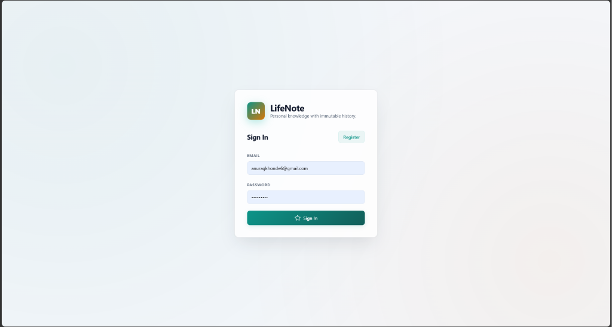
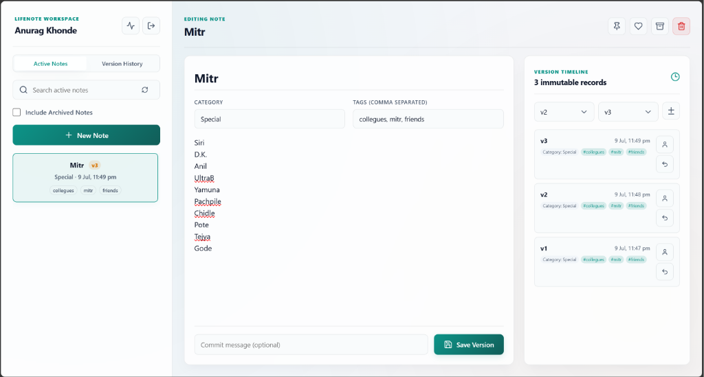
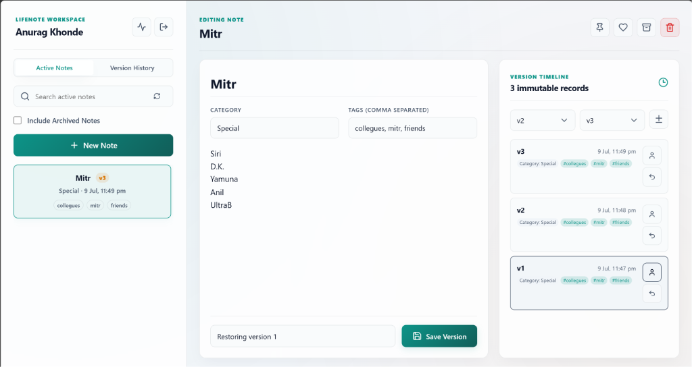
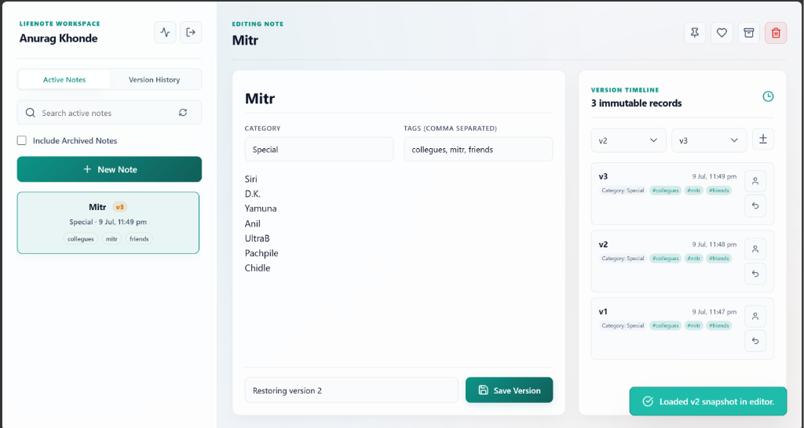
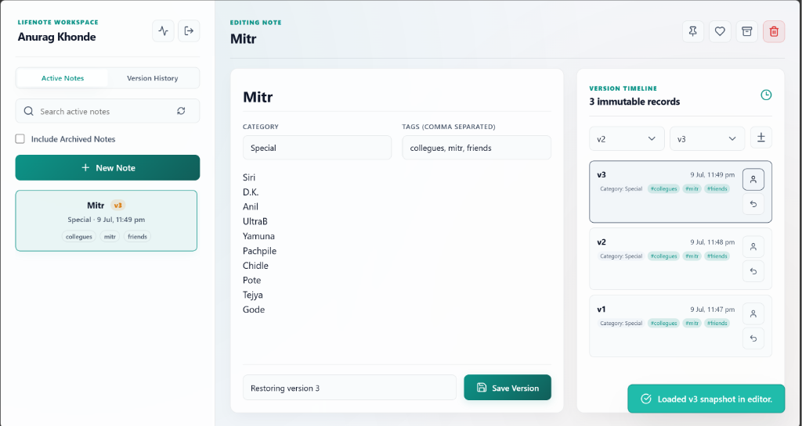

# LifeNote

### Multi-User Personal Notes Management System with Intelligent Version Control

LifeNote is a secure, multi-user note-taking platform designed for individuals who want complete control over the evolution of their personal knowledge base. By combining modern web engineering with version control principles, LifeNote guarantees that your notes are securely isolated and version-tracked forever.

---

## 📸 Interface Preview

### Secure Sign-In Portal
The entry point features a premium light glassmorphic portal with integrated security prompts and validations.


### The Workspace (Active Editing & Immutable History)
The primary note workspace displays the active note list, tag management, real-time query controls, and the version control timeline on the right side.


### Chronological Snapshots & Restore Logs
The system tracks every content modification as an immutable version snapshot, allowing you to load older states into the editor and restore snapshots instantly.




---

## ⚡ Core Features

*   **Cryptographic User Isolation**: All resources are strictly bound to the authenticated JWT actor. Users cannot read, query, or edit notes belonging to other workspaces.
*   **Intelligent Version Control**: 
    *   Creates immutable versions (`NoteVersion` snapshots) upon modifications.
    *   **Duplicate Prevention**: Standard text updates are audited. Saving a note without content changes will update database metadata (e.g. pinned/favorite status) without polluting your version history.
    *   **Compare Tool**: Inline diff renderer showing added, removed, and modified line changes.
*   **Security & Activity Trail Log**: Tracks account creations, profile updates, notes modifications, and version restores alongside client metadata (IP Address, User-Agent browser detection).
*   **Method Security (RBAC)**: Fine-grained Role-Based Access Control (`ROLE_USER` vs `ROLE_ADMIN`) using Spring Security `@PreAuthorize` method annotations. Includes administrative search utilities (`GET /api/audit/all`) for `ROLE_ADMIN` users.
*   **Premium Glassmorphic UI**: Strictly light mode default design leveraging Google Font Outfit, smooth backdrop blur systems, interactive micro-animations (`active:scale-[0.97]`), and full mobile responsiveness.
*   **API Exploration**: Fully integrated Swagger UI for sandbox testing.

---

## 🛠️ Technology Stack

### Backend (Java Spring Boot)
*   **Core Framework**: Spring Boot 4.0.0 (Java 22 JDK)
*   **Security**: Spring Security & Jakarta Method Security (RBAC)
*   **Token Authentication**: JJWT (Java JWT) 0.12.7
*   **Database Access**: Spring Data JPA & Hibernate
*   **Databases**: PostgreSQL (Production) / H2 (In-memory testing)
*   **API Documentation**: Springdoc OpenAPI / Swagger UI 2.6.0
*   **DTO Mappers**: MapStruct 1.6.3

### Frontend (React & Modern CSS)
*   **Runtime**: React 19.0.0 & Vite 7.0.0
*   **Icons**: Lucide React
*   **Styling**: Vanilla CSS with custom property systems (Glassmorphic variables)

---

## 📂 Project Architecture

```
lifeNote Project/
│
├── lifeNote backend/
│   └── lifeNote/
│       ├── src/main/java/com/akstar47/lifeNote/
│       │   ├── audit/         # Audit Log Trails (Entity, Service, Controller)
│       │   ├── auth/          # Login & Registration JWT controllers
│       │   ├── common/        # Configs (OpenAPI, Exception handlers)
│       │   ├── note/          # Note & Version logic (Entities, Services)
│       │   ├── security/      # Security Configs & Filter Chains
│       │   └── user/          # User Profiles & RBAC
│       └── pom.xml            # Maven Configuration
│
├── lifeNote frontend/
│   ├── src/
│   │   ├── App.jsx            # Main Workspace Controller
│   │   ├── api.js             # Fetch Wrapper with JWT header mappings
│   │   ├── main.jsx           # Diagnostic ErrorBoundary & React entry point
│   │   └── styles.css         # Glassmorphic Design Variables & Styles
│   └── package.json
│
└── docs/
    └── images/                # Preview Screenshots
```

---

## 🚀 Installation & Launch

### 1. Database Setup
Create a PostgreSQL database named `lifenote` (or configure your connection parameters in the backend properties):
```sql
CREATE DATABASE lifenote;
```

### 2. Run the Backend
Configure database coordinates in `src/main/resources/application.properties`:
```properties
spring.datasource.url=jdbc:postgresql://localhost:5432/lifenote
spring.datasource.username=your_username
spring.datasource.password=your_password
```
Package and run the application:
```bash
cd "lifeNote backend/lifeNote"
.\mvnw.cmd clean package
.\mvnw.cmd spring-boot:run
```
*   **Swagger API Docs URL**: [http://localhost:8080/swagger-ui/index.html](http://localhost:8080/swagger-ui/index.html)

### 3. Run the Frontend
Instantiate Node packages and boot the local Vite server:
```bash
cd "lifeNote frontend"
npm install
npm run dev
```
*   **Frontend UI URL**: [http://localhost:5173/](http://localhost:5173/)
